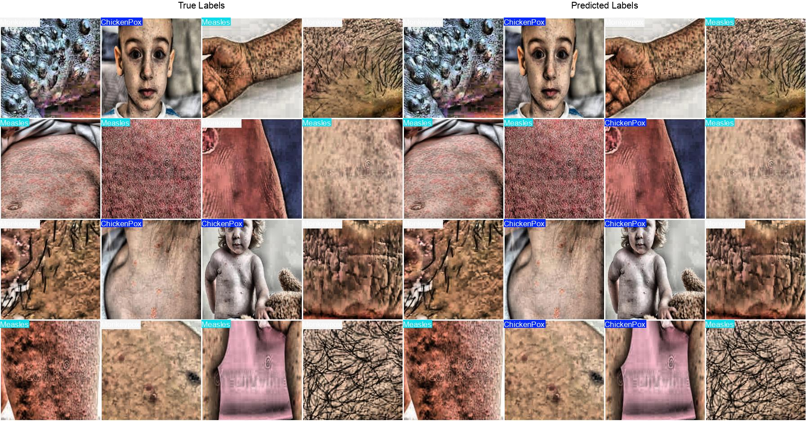

# Viral Rash Classification

## Project Overview
This project aims to classify three infectious skin diseases - Chickenpox, Measles, and Monkeypox - using various deep learning models. The goal is to compare the performance of different architectures on a relatively small dataset of medical images.

### Dataset

<b>Total classes</b>: 3 (Chickenpox, Measles, Monkeypox)  
<b>Training data</b>: 160 images per class (480 total) 
<b>Validation data</b>: 33 images per class (99 total) 

## Models Implemented

### Custom CNN

<b>Parameters</b>: 31.58 million 
<b>Architecture</b>: Custom-designed convolutional neural network 

### ResNet50

<b>Parameters</b>: 23 million (pretrained) 
<b>Architecture</b>: 50-layer residual network 

### Inception-ResNet-V2

<b>Parameters</b>: 55.9 million (pretrained) 
<b>Architecture</b>: Hybrid of Inception and ResNet architectures 

### NASNet-A-Large

<b>Parameters</b>: 89 million (pretrained) 
<b>Architecture</b>: Neural Architecture Search Network 

## YOLO11n Classification

YOLO11 classification is an evolution of the YOLO (You Only Look Once) architecture tailored for image classification tasks. It processes images in real-time, leveraging its speed and accuracy.

Download images folder from the following link:
<a href ='https://drive.google.com/file/d/1uRUF5hoAjwKuinrVuZV49FSMaXhrOHlZ/view?usp=sharing'> Rash Images</a>