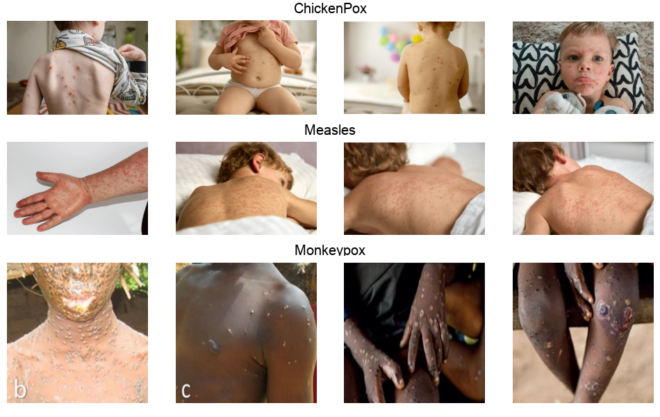

# Viral Rash Classification

## Project Overview
This project aims to classify three infectious skin diseases - Chickenpox, Measles, and Monkeypox - using various deep learning models. The goal is to compare the performance of different architectures on a relatively small dataset of medical images.

### Dataset

    - <b>Total classes</b>: 3 (Chickenpox, Measles, Monkeypox)
    - <b>Training data</b>: 160 images per class (480 total)
    - <b>Validation data</b>: 33 images per class (99 total)

## Models Implemented

### Custom CNN

    - <b>Parameters</b>: 31.58 million
    - <b>Architecture</b>: Custom-designed convolutional neural network

### ResNet50

    - <b>Parameters</b>: 23 million (pretrained)
    - <b>Architecture</b>: 50-layer residual network

### Inception-ResNet-V2

    - <b>Parameters</b>: 55.9 million (pretrained)
    - <b>Architecture</b>: Hybrid of Inception and ResNet architectures

### NASNet-A-Large

    - <b>Parameters</b>: 89 million (pretrained)
    - <b>Architecture</b>: Neural Architecture Search Network
